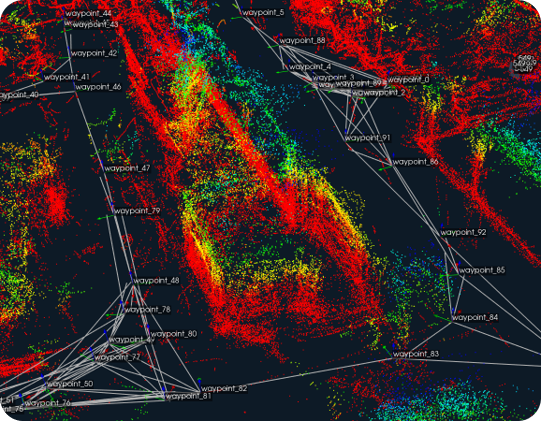

## GraphNav

### Overview

GraphNav is an navigation system developed by Boston Dynamics, primarily designed for their robotic platforms like Spot. GraphNav enables these robots to navigate complex environments autonomously by creating and utilizing 3D maps. It consists of the following main functionalities:

#### 3D Mapping

The robot creates detailed 3D maps of its environment with it's depth-cameras.
GraphNav is a graph-based method for map generation and navigation.
Waypoints are the nodes in the graph and contain spatial information as a point cloud.
The edges between waypoints contain the realativ traformation of the poses of different waypoints. They can also save the information, whether spot should navigate in stair-mode between two nodes or only allow the navigation in one direction. Above you can see an exaple of a map user in GraphNav to navigate.

<center>

</center>

#### Localization
Once the map is created, the robot can determine its position within that map, allowing it to navigate accurately. For localization the robot can estimate its position using a fiducial or a predefined waypoint. Therefor the fiducial or the selected waypoint have to be part of the map. 

#### Navigation

GraphNav allows robots to plan optimal paths from one point to another within the mapped environment. For navigation it calucaltes the shortest path. 
It can detect and navigate around obstacles that may not have been present during the initial mapping. It will automatically return to the graph after the obstacle has passed.

### Setup SpotSDK

GraphNav is part of the SpotSDK, therefore the SpotSDK has to be installed to be able to record a map. If you only want to navigate with spot with a recoded map, you don't habe to install it, as the navigation is integrated to ROS2.


1. [Install SpotSDK](https://dev.bostondynamics.com/docs/python/quickstart.htmle) via pip for python

2. Clone the SDKRepo for access to the examples
```shell
$ git clone https://github.com/boston-dynamics/spot-sdk.git
$ cd spot-sdk
```
3. Navigate to recording_command_line example
```shell
$ cd python/examples/graph_nav_command_line
```
4. Install missing dependencies for the map-recoding tool via pip
```shell
$ python3 -m pip install -r requirements.txt
```

### Map Recording
1. Start the robot and enable motor-power with the tablet.

    **Hints:**
    - *Before you start, make sure that the robot is in a location where it can see a fiducial. The robot will later use this fiducial to initialize to the map.*
    - *Let the robot undock, before starting to record a map. Otherwise the first waypoint is set on the docking station which can lead to bad behaviour if spot tries to reach a waypoint which is on the docking station.*

2. Access to spots internal wifi with your device

3. Start the map-recording-tool  (ROBOT_IP: 192.168.80.3)
```shell
$ python3 -m recording_command_line --download-filepath <path_to_downloaded_map> ROBOT_IP
```
4. Start recording a map by pressing 1 in the command-line-tool

5. Navigate spot with the tablet to generate a map 

    **Hints:**
    - *Do not create any default waypoints if you want to use GraphNav within ROS2 cause the user version of Spot Wrapper is not able to read these waypoints correctly*

6. For more deatailed usage read the [tool-description](https://dev.bostondynamics.com/python/examples/graph_nav_command_line/readme)


#### Optimize map
    (7) Create new edge between existing waypoints using odometry.
    (8) Create new edge from last waypoint to first waypoint using odometry.
    (9) Automatically find and close loops.
    (a) Optimize the map's anchoring.


If the map wasn't directly recorded copy the whole folder of the downloaded graph and send it to spot's Jetson.


### Setup ROS-Driver for Navigation
Theoretically the standard spot-ROS2-driver should be capable of handling the navigation of GraphNav.
Practically the driver was not well tested for navigation vith graph-nav and the functionallity for navigation did not work out of the box with the driver because of some bugs.
Therfore we created a new repo which handles some of the bugs and enables the opportunity to navigate to waypoints using GraphNav.

Be now provide the important changes to the driver to enable the navigation.

### Navigation

For navigation with GraphNav we provided an example program that allows the robot to automatically wake up and stand up and navigate to defined waypoint. You can find the example **spot_navigation_client.py** in the spot_examples directory of our modified spot-ros2-driver package.

Before you are able to run the example make sure that the recorded graph is loaded and if not clear the current graph and upload the new graph like this or call the via rqt:

 ```shell
$ ros2 service call /hkaspot/graph_nav_clear_graph spot_msgs/srv/GraphNavClearGraph
$ ros2 service call /graph_nav_upload_graph spot_msgs/srv/UploadGraph "{upload_filepath: '<path_to_downloaded_map>'}"
```

--robot", type=str, default=None)
--navigate_to", type=int, default=0)
--initialize_position", type=bool, default=False)
--upload_path", type=str, default="/home/robot/spot_map/downloaded_graph")
--initial_localization_fiducial", type=bool, default=True)
--initial_localization_waypoint", type=str, default="")


