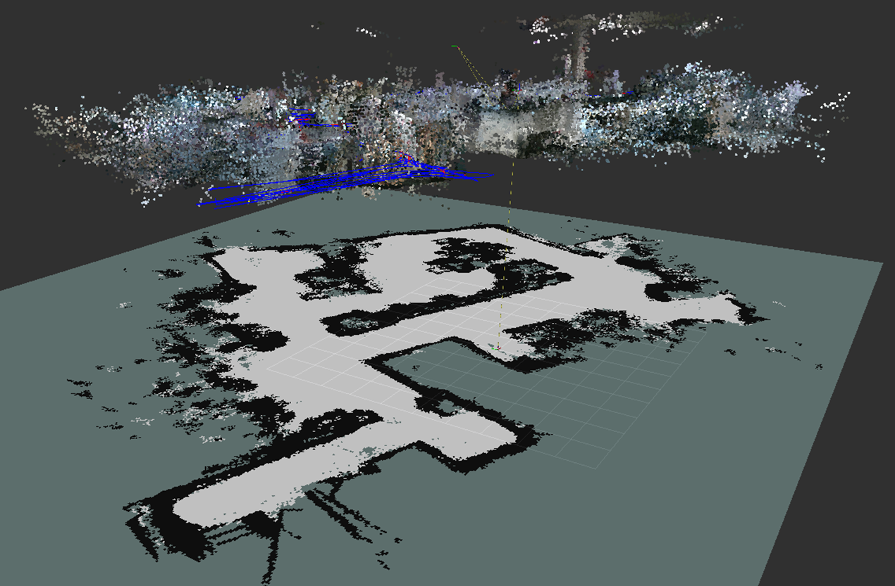
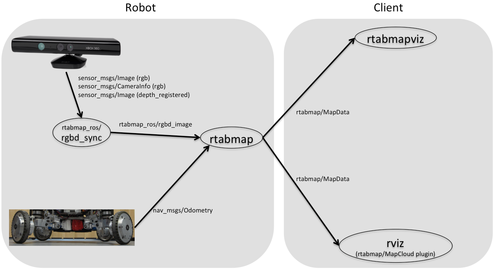
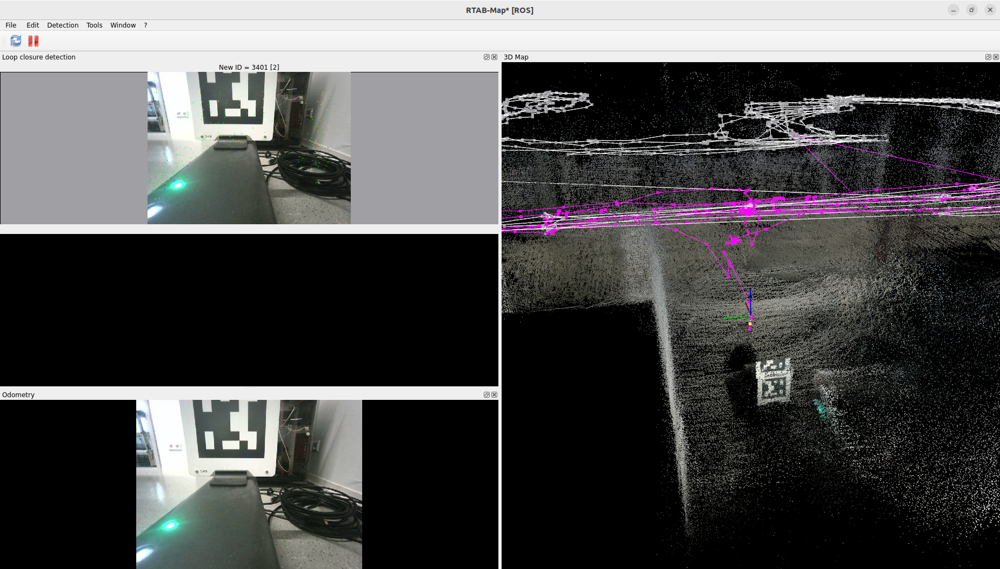
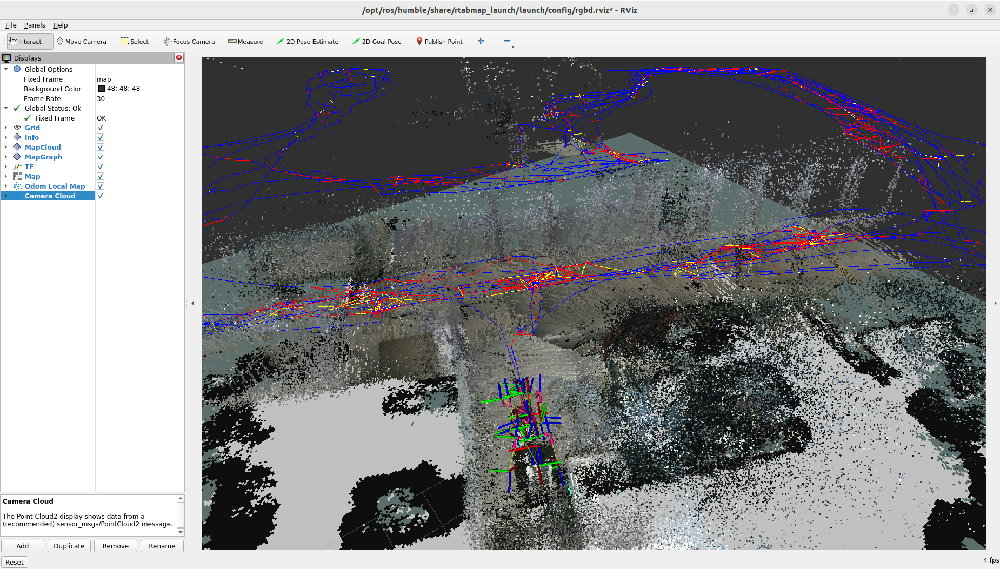
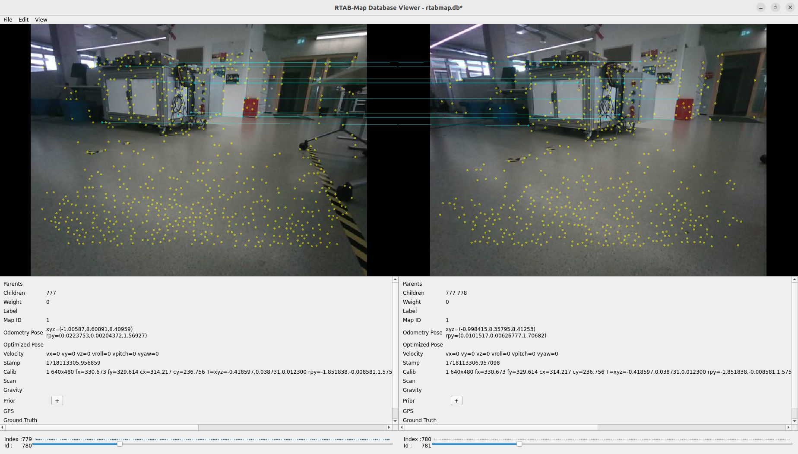
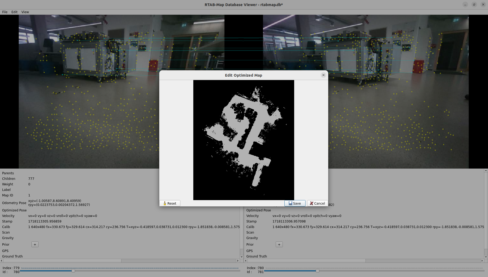
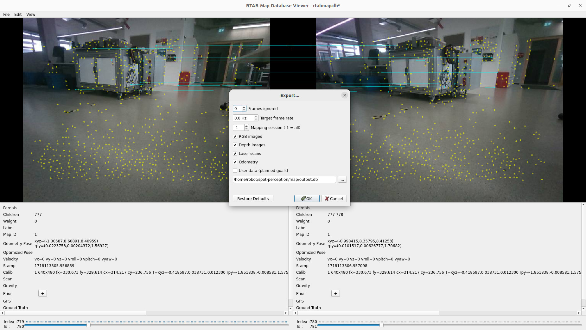

# **Spot-Perception**

This repository extends the [ROS2 Package for Spot](https://github.com/bdaiinstitute/spot_ros2) by integrating ROS based SLAM and navigation functionalities.

**Important:** As the `humble` branch is outdated and `main` is a rolling release branch, this repository uses a fixed commit to guarantee functionality. This means that newer features of of the Spot ROS2 package might not be available out of the box. However, updating to a newer version of the package is easily possible as long as the config file is updated aptly.

The SLAM package is computationally intensive and requires sufficient processing power to function smoothly. During the develepement of this package, a [NVIDIA Jetson Orin 64gb](https://developer.nvidia.com/embedded/learn/jetson-agx-orin-devkit-user-guide/index.html) was used for edge computing locally on Spot.

***
# 1. Quick Start

This assumes you have configured your hardware correctly with Spot. Refer to the [Hardware Section](#hardware-and-interfacing) for more information on configuring and interfacing your hardware directly with spot.

1. Configure the `spot_ros_config.yaml` under configs with your spot username, password and Payload port IP under hostname:

```yaml
username: "user"
password: "password"
hostname: "10.0.0.3"
```

2. Select a name for spot and add it to the entrypoint file under `docker/spot-ros2/entrypoint.sh`. The file looks like this:

```bash
#!/bin/bash
source /opt/ros/$ROS_DISTRO/setup.bash
source /home/robot/spot_ros2_ws/install/setup.bash
export $SPOT_NAME="myspot" # --> HERE
ros2 launch spot_driver spot_driver.launch.py config_file:=./src/spot_ros2/configs/spot_ros_config.yaml spot_name:=$SPOT_NAME publish_point_clouds:=True

```

3. select your preferred odom frame in `spot_ros_config.yaml`under configs using your **SPOT_NAME**:

```yaml
preferred_odom_frame: "myspot/odom" # pass either odom/vision. This frame will become the parent of body in tf2 tree and will be used in odometry topic. https://dev.bostondynamics.com/docs/concepts/geometry_and_frames.html?highlight=frame#frames-in-the-spot-robot-world for more info.
```

4. Pull the latest docker images:
   **Note**: This requires an account at [dockerhub](www.dockerhub.com) and logging on locally on your machine

```bash
docker pull eshansavla0512/ros2-spot-arm64:rework
docker pull eshansavla0512/ros2-rtabmap-arm64:latest
```

5. Alternatively, you can build the containers locally on your amd64 machine or on arm64 machine with at least 16gb of RAM

```bash
bash ./build_docker.sh # for build on native arm64 architecture
bash ./build_docker.sh --cross-compile # for emulating arm64 builds on amd64 architecture
```

**Note**: Depending on your internet connection, this can take between 30-60 mins for a fresh build.

6. Running the containers
   To run the containers, just run:

```bash
bash start_docker.sh
```

This will launch the docker compose command which takes care of starting both containers - the spot ros2 driver and slam + nav2 container with the appropriate parameters.

7. Start Navigating with Nav2 on your local machine:
   **Note:** This requires you to locally install ros2 humble and nav2 on your own machine. If you have them installed in a container, run the same command inside your container.

```bash
source /opt/ros/humble/setup.bash
ros2 launch nav2_bringup rviz.launch.py
```

Your screen should look something like this:

%TODO: Add screenshot of rviz with map

**Hint -** You can blend spots model in rviz by selecting the right topic under RobotModel>%TODO finish rest

8. Using the _Nav2 Goal_ option you can click on your goal point and drag your mouse while holding down the left button to provide your goal orientation for spot.

%TODO: Add screenshot with arrow and planned trajectory


***
# 2. Hardware and Interfacing

##### Parts list

In order to copy the subsequent description of the hardware setup, additional parts are required. The following list contains all the parts needed, where some of them are models which need to be 3D-printed.

• [NVIDIA Jetson Orin 64gb](https://developer.nvidia.com/embedded/learn/jetson-agx-orin-devkit-user-guide/index.html)  
• [General Expansion Payload (GXP) module](https://support.bostondynamics.com/s/article/Spot-General-Expansion-Payload-GXP)  
• „jetson-platte.prt“ (3D printed) [(click here to download the 3D model)](models/jetson-platte.stl)  
• „jetson-deckel.prt“ (3D printed) [(click here to download the 3D model)](models/jetson-deckel.stl)  
• 4x threaded inserts M6  
• 4x cylinder head screw M6x80  
• 4x cylinder head screw M5x10  
• 4x washer M6  
• 4x washer M5  
• 6x [T-slot nut](https://de.misumi-ec.com/vona2/detail/110302247820/?HissuCode=HNTR5-5)  
• [15-pin D-SUB male connector](https://www.conrad.de/de/p/tru-components-t1904c098-d-sub-stiftleisten-set-polzahl-15-schrauben-1-st-2108938.html?hk=SEM&WT.mc_id=google_pla&gad_source=1&gclid=CjwKCAjwuJ2xBhA3EiwAMVjkVI6hCHULTX5bZtmSpPjy9u6TFpEu-Qj3K-N-bZPuuvF46AN-jl-E2hoCSQwQAvD_BwE&refresh=true)  
• [power cable](https://www.reichelt.de/adapterkabel-2000-mm-dc-stecker-auf-freies-ende-dc-aks-7521-p150125.html?PROVID=2788&gad_source=1&gclid=EAIaIQobChMIvvSshPrIhQMVigcGAB0KjAioEAQYASABEgK4bfD_BwE)  
• Ethernet cable

##### Mount for Jetson:

For operating the SLAM package, the [NVIDIA Jetson Orin 64gb](https://developer.nvidia.com/embedded/learn/jetson-agx-orin-devkit-user-guide/index.html) must first be permanently mounted on the robot. Spot has two mounting rails on its back for this purpose, on which such payloads can be mounted using t-nuts. However, the Jetson computer does not have any mounting holes. For this reason, a bracket is designed that fixes the computer from above and below by clamping and can be produced using a 3D printer (see picture below). Threaded inserts are melted into the plastic in the lower part in order to securely clamp Jetson with four screws in the corners. The recess in the upper part is positioned above the fan location to ensure that it operates seamlessly. The unit is mounted on Spot using a further four screws in the base plate.


##### Power supply and data communication interface:

Jetson must be supplied with power and connected correctly to the spot core to ensure communication between the systems. To connect such external devices, Boston Dynamics offers the [General Expansion Payload (GXP) module](https://support.bostondynamics.com/s/article/Spot-General-Expansion-Payload-GXP). This is also screwed onto the mounting rails and connected to the front of the two DB25 sockets. A regulated power supply can then be tapped from the GXP module using an [15-pin D-SUB male connector](https://www.conrad.de/de/p/tru-components-t1904c098-d-sub-stiftleisten-set-polzahl-15-schrauben-1-st-2108938.html?hk=SEM&WT.mc_id=google_pla&gad_source=1&gclid=CjwKCAjwuJ2xBhA3EiwAMVjkVI6hCHULTX5bZtmSpPjy9u6TFpEu-Qj3K-N-bZPuuvF46AN-jl-E2hoCSQwQAvD_BwE&refresh=true). The table below shows which pins to use for connection. We chose pins 13 (+24V) and 1 (GND) for a supply voltage of 24 V (max. 150 W).


The data connection is made via an Ethernet cable, which is simply connected to the GXP bridge. The figure beneath shows the connected and mounted Jetson on Spot.


##### Add payload in web interface for collision avoiding:

When adding payloads on top of spot, the internal collision avoiding system does not automatically take this into account while path planning. For example Spot can walk under tables with nothing attached, but when the Jetson is mounted on its back, he has to crouch to not collide. Therefor these additional obstructions have to get added to the kinematic structure to make the algorithm consider them. In order to do this, the following steps are required.

###### Step 1: Connect to Spots WIFI

On Spots belly you can find Spots "Default Network information" (See picture below). Connect your computer to spots WIFI SSID, in our this case it is "spot-BD-31580012". You can find the WIFI password on the sticker as well.


###### Step 2: login to the spot configuration page

On the sticker from "step 1" you can also find the login credentials for the spot configuration page.

- open your browser and search for "192.168.80.3"
- a page saying "Sign in to TurboDoggy" should open. Sign in witth the "Admin" credentials from the sticker.


###### Step 3:

- On the menu bar on the right, select "Add payload"
- This screen shows you all payloads added so far. Select "Add payload" again to subjoin another one.


###### Step 4:

This Screen is to configure the new payload:

- add a name and a description
- add the dimensions and position of the square box representing your payload
- add the weight of your payload


***
# 3. Software architecture

***
# 4. Configuration of spot ros2 package

***
# 5. RTAB-Map
RTAB-Map (Real-Time Appearance-Based Mapping) is an RGB-D Graph SLAM (Simultaneous Localization and Mapping) method for map recording that utilizes a global Bayesian loop closure detector. This detector employs a bag-of-words approach to assess the likelihood of whether a new image corresponds to a previously visited location or a new one. When a loop closure hypothesis is confirmed, a new constraint is introduced into the map's graph, and a graph optimizer works to minimize errors in the map. A memory management strategy is implemented to restrict the number of locations used for loop closure detection and graph optimization, ensuring that real-time performance is maintained even in large-scale environments.

The documentation and a few tutorials for RTAB-Map can be found on the following page: [RTAB-Map ROS Wiki](http://wiki.ros.org/rtabmap_ros/noetic_and_newer)



## Overview of architecture
Using RTAB-Map within this package enables the capability to map environments using the depth cameras integrated into Spot mini. The decision to use RTAB-Map was made because nav2 Navigation Stack does not support depth cameras as sensor inputs and RTAB-Map allows for 3D mapping. This 3D mapping capability holds greater potential for navigating Spot mini in multi-story buildings. RTAB-Map supports integrating various sensors and odometry sources for mapping. Additionally, RTAB-Map provides tools to optimize recorded maps to enhance navigation and can also operate as a navigation instance providing the optimized map to the nav2 Navigation Stack.



## Installation and Configuration of RTAB-Map
RTAB-Map can be installed as an apt package with the following command:
```bash
sudo apt install ros-$ROS_DISTRO-rtabmap-ros
```

Following the installation, the package should be configured for use with Spot mini in `entrypoint.sh`. The following lines are responsible for starting the RTAB-Map package. Only the following arguments should be passed. Additional arguments may compromise the smooth operation with Spot mini.

```bash
ros2 launch rtabmap_launch rtabmap.launch.py \
    rgb_topic:=/hkaspot/camera/back/image \
    depth_topic:=/hkaspot/depth_registered/back/image \
    camera_info_topic:=/hkaspot/camera/back/camera_info \
    database_path:=/home/robot/spot-perception/map/rtabmap_copy.db \
    odom_frame_id:=hkaspot/odom \
    odom_topic:=/hkaspot/odometry \
    visual_odometry:=false \
    frame_id:=hkaspot/body \
    subscribe_depth:=false \
    subscribe_rgbd:=false \
    rgbd_sync:=true \
    approx_sync:=true \
    queue_size:=1000 \
    qos:=1 \
    rviz:=true \
    rtabmap_viz:=true \
    localization:=true
```

Below, the entries of the entrypoint are further explained.

### Camera Information

```bash
rgb_topic:=/hkaspot/camera/back/image \
```

Here, the corresponding camera topic is passed to RTAB-Map. Spot mini has five depth cameras positioned at various locations. At the time of this project, RTAB-Map supports recording with only one camera signal, so not all five cameras can be used. Due to the fact that the raw data from the two front cameras are rotated by 90 degrees, the rear camera is chosen here. Since the robot's odometry is also used for recording, this orientation does not affect its navigation.

```bash
depth_topic:=/hkaspot/depth_registered/back/image \ 
```

This topic is used to pass depth data to RTAB-Map. Depth data and RGB data are synchronized with the following line.

```bash
rgbd_sync:=true \
```

The following line should be used to pass camera information to RTAB-Map in order to correctly create point clouds:

```bash
camera_info_topic:=/hkaspot/camera/back/camera_info \
```

### Orientation and Odometry

For mapping, odometry is necessary to continuously track the robot's position and orientation. This can be achieved in two ways. Firstly, RTAB-Map can determine odometry directly from the provided image data. Secondly, if available, the robot's odometry information can be directly fed into RTAB-Map.

The determination of odometry via the camera images is only recommended as long as the environment has a lot of visual structure and features. If this is not the case, RTAB-Map will not be able to continuously calculate the odometry (also shown in the visualisation) and the odometry data of the robot should be used for this. As these are available via the Ros driver for Spot mini, this has been done here. The topic for the odometry is set in the following line:

```bash
odom_topic:=/hkaspot/odometry \
```

The frame in which the odometry data is given should also be set:

```bash
odom_frame_id:=hkaspot/odom \ 
```

In addition, the calculation of visual odometries from the camera data must be explicitly deactivated:

```bash
visual_odometry:=false \ 
```

The frame ID in which the map is recorded must also be configured:

```bash
frame_id:=hkaspot/body \
```

### Vizualization via RTAB-Tool and RViz

To record the map, you can start your own visualisation provided by RTAB-Map as well as RViz:

```bash
rviz:=true
```

```bash
rviz:=false
```

The image below shows the RTAB-Map visualisation tool. In the right half, the map created in 3D and the path of Spot mini can be viewed. The left half provides information on loop closure detection and odometry. 



Loop Closure Detection checks whether locations that have already passed can be recognised. If this is the case, the odometry data is matched, which can lead to a better-resolved map in terms of position and orientation. 

The odometry window should never appear dark red if the odometry data is fed in directly. If this is the case, the visualisation indicates that the odometry could not be calculated from the image data at this time, which consequently suggests that the odometry data of the robot is not being used, which can lead to some inaccuracies depending on the environment.

Parallel to the visualisation of RTAB-Map itself, the map can also be viewed in RViz parallel to the recording.



RViz is automatically started correctly configured. The three-dimensional map can also be seen as a point cloud. The paths already travelled are also shown here. Below the point cloud on one level, you can also see the two-dimensional map, which you can then navigate through using nav2 Navigation Stack.
### Saving of Map (Database)

The storage path for the database should be configured with this entry both for recording the map and for navigation:

```bash
database_path:=/home/robot/spot-perception/map/rtabmap_copy.db \
```

As the application runs in Docker containers, this file path should also be mounted externally on the PC!


### Mapping or Navigation mode

As already mentioned in Overview, RTAB-Map should also be started for navigation in a map. To record a map itself, the following launch parameter should be set to FALSE:

```bash
localization:=false
```

For navigation with nav2 Navigation Stack, RTAB-Map provides the map and the localization of the Spot mini. The parameter should then be set to TRUE:

```bash
localization:=true
```

All other launch parameters should also be set as shown in the extract above.


## Recording of Map

To record a map, the container should be started with the following configuration in ‘entrypoint.sh’:

```bash
ros2 launch rtabmap_launch rtabmap.launch.py \
    rgb_topic:=/hkaspot/camera/back/image \
    depth_topic:=/hkaspot/depth_registered/back/image \
    camera_info_topic:=/hkaspot/camera/back/camera_info \
    database_path:=/home/robot/spot-perception/map/rtabmap_copy.db \
    odom_frame_id:=hkaspot/odom \
    odom_topic:=/hkaspot/odometry \
    visual_odometry:=false \
    frame_id:=hkaspot/body \
    subscribe_depth:=false \
    subscribe_rgbd:=false \
    rgbd_sync:=true \
    approx_sync:=true \
    queue_size:=1000 \
    qos:=1 \
    rviz:=true \
    rtabmap_viz:=true \
    localization:=false
```

As you can see, localization has been deactivated so that RTAB-Map starts in mapping mode. RViz and the RTAB-Map visualisation should now start. Recording is then already active. 

To record, Spot mini should be controlled manually using the Boston Dynamics remote control. The map should now be three-dimensional in both visualisations. 

Due to the rather low resolution of the Spot internal cameras of 640x480, the robot should not be moved too quickly. It can also be useful to rotate the robot at various points. This allows more image data to be taken into account when creating the map. Care should also be taken to ensure that the robot moves smoothly and experiences few vibrations, as these can affect the accuracy of the odometry data and thus cause errors in the localization on the map. 

The database for the map is constantly updated during recording. Nevertheless, it is advisable to save the map again at the end using the RTAB map visualisation.


## Navigation

As already mentioned, path planning and navigation is handled by nav2 Navigation Stack. However, an instance of RTAB-Map must be started so that the map is made available to nav2 via a topic. To do this, the entry in ‘entrypoint.sh’ must be configured as follows:

```bash
ros2 launch rtabmap_launch rtabmap.launch.py \
    rgb_topic:=/hkaspot/camera/back/image \
    depth_topic:=/hkaspot/depth_registered/back/image \
    camera_info_topic:=/hkaspot/camera/back/camera_info \
    database_path:=/home/robot/spot-perception/map/rtabmap_copy.db \
    odom_frame_id:=hkaspot/odom \
    odom_topic:=/hkaspot/odometry \
    visual_odometry:=false \
    frame_id:=hkaspot/body \
    subscribe_depth:=false \
    subscribe_rgbd:=false \
    rgbd_sync:=true \
    approx_sync:=true \
    queue_size:=1000 \
    qos:=1 \
    rviz:=true \
    rtabmap_viz:=true \
    localization:=true
```

This starts RTAB-Map in localization mode. As the navigation of Spot mini takes place via a separate computer in the same network anyway, no visualization needs to be started directly on the Jetson. For this reason, RViz and RTABMap_Viz are both set to FALSE. The configuration of Localization to TRUE is crucial. Only then will RTAB-Map be started in localization mode and no map will be recorded. 


## Subsequent optimization of the map

RTAB-Map already offers another tool, rtabmap-databaseViewer, for subsequent optimisation of the map after recording. 

The application can be started with the following command. The path belonging to the map must be specified.

```bash
rtabmap-databaseViewer /home/robot/spot-perception/map/rtabmap_copy.db
```

The Database Viewer opens, as shown in the following illustration:



This tool can be used to view and customise all the images contained in the map. Via Edit > Detect more loop closures, the entire data set is looked through again and optically identical points are found that can close the nodes in the map. 

### Optimization of 2D map
Since only the 2D map will be used for navigation with the nav2 Navigation Stack in a later step, this map can also be adjusted and edited here. To do this, the map can be opened in a new window via Edit -> Optimize 2D map, as shown below.



Here, you can right-click to choose whether to add an obstacle or delete an obstacle. Then, by pressing the left mouse button, you can modify or redraw the map. This step can be particularly helpful when dealing with low-resolution cameras. Often, the 2D map contains individual points that are stored as obstacles, even though there is actually none. These points can then be retouched using this tool, allowing the robot to pass through the corresponding area.

### Save the optimized map


As shown above, the optimized map should then be exported and saved via File -> Export, so that the changes take effect.


***
# 6. nav2 Navigation Stack
Nav2 is the successor to the ROS Navigation Stack. It enables mobile robots to navigate through complex environments and perform custom tasks with nearly any type of robot kinematics.
Nav2 can not only move from Point A to Point B but also handle intermediate waypoints. It provides functions for perception, planning, control, localization, and visualization.
It creates an environmental model from sensor and semantic data, dynamically plans paths, calculates motor commands, avoids obstacles, and structures higher-level robot behaviors.
As output, Nav2 provides valid velocity commands for the robot's motors.

## Installation
To control the robot from a PC using Nav2, it is necessary to install Nav2 on the PC. Installation can be carried out using the guide from the following link:
[Nav2 Installation Guide](https://docs.nav2.org/getting_started/index.html)

## Configuration
To enable Nav2 to communicate with the Spot Mini, it is necessary to adjust some configurations in the Nav2 parameter file. The file can be found in the project at the following path:

`spot-perception/configs/nav2_params.yaml`

Since the Spot Mini uses different naming conventions than those used by Nav2 by default, the following lines in the parameter file need to be adjusted to match the naming conventions of the Spot Mini.
The parameters to be adjusted describe the assignment of `base_frame`, `global_frame`, `local_frame`, and the Odometry topic of the spot for nav2:


```yaml
44  robot_base_frame: hkaspot/body
45  odom_topic: hkaspot/odometry
190 global_frame: hkaspot/odom
191 robot_base_frame: hkaspot/body
227 robot_base_frame: hkaspot/body
306 local_frame: hkaspot/odom
308 robot_base_frame: hkaspot/body
335 odom_topic: "hkaspot/odometry"
342 base_frame_id: "hkaspot/body"
343 odom_frame_id: "hkaspot/odom"
```
Additionally, it is important to note that the plugin assignment in the parameter file uses `/` instead of `::` as originally included. The relevant lines are listed below:

```yaml
   274	plugin: "nav2_navfn_planner/NavfnPlanner"
   297 	plugin: "nav2_behaviors/Spin"
   299	plugin: "nav2_behaviors/BackUp"
   301	plugin: "nav2_behaviors/DriveOnHeading"
   303	plugin: "nav2_behaviors/Wait"
   305  plugin: "nav2_behaviors/AssistedTeleop"
```

With the start of the RTAB-Map Docker, Nav2 is launched with the adjusted `nav2_params.yaml` through the following line in the entrypoint.

`ros2 launch nav2_bringup navigation_launch.py params_file:=spot-perception/configs/nav2_params.yaml`


## Remapping

To ensure that the velocity commands output by Nav2 are received by the Spot, additional topic remappings from Nav2 to the Spot's topic need to be applied. This must be done in the `navigation_launch.py` file at the following path.

`spot-perception/launch/navigation_launch.py`

The following lines need to be adjusted for this:

```yaml
135	remappings=remappings + [('cmd_vel', 'hkaspot/cmd_vel')],
168	remappings=remappings + [('cmd_vel', 'hkaspot/cmd_vel')],
202	remappings=remappings + [('cmd_vel', 'hkaspot/cmd_vel')],
238	remappings=remappings + [('cmd_vel', 'hkaspot/cmd_vel')],
259	remappings=remappings + [('cmd_vel', 'hkaspot/cmd_vel')],
```


## Navigation in RViz

Once the Docker is started, the Spot Mini can be controlled from an external PC using RViz. The following requirements must be met:

1. The PC and the Jetson must be on the same network. The network `ILKA-RoboLab2` can be used for this purpose.
2. The ROS Domain ID of the PC must match that of the Jetson.

To change the ROS Domain ID on the PC, execute the following command in the terminal:

```bash
export ROS_DOMAIN_ID=33
```

To check the ROS Domain ID, use the following command:

```bash
echo $ROS_DOMAIN_ID
```

Then, RViz can be started on the PC using the following command in the terminal:

```bash
ros2 launch nav2_bringup rviz_launch.py
```

RViz should then open on the PC as shown below:


The following settings should be present on the left side under Display.

.png)
.png)

To control the Spot via RViz, ensure that the topics for `Description`, `Topic`, and `Update Topic` match the topics shown in the images.

To navigate, use the `Nav2 Goal`, which can be found in the selection at the top center. To set a goal, click on the Nav2 Goal selection with the left mouse button and draw a direction arrow on the map while holding down the mouse button. This arrow indicates the desired orientation of the Spot when it arrives at the destination.

It is important to select only white or light-colored areas on the map for navigation, as dark areas represent obstacles. The map shown was taken in the laboratory (ground floor) at LTC.

Once a reachable goal is selected on the map, Nav2 begins planning the path to that goal point. The planned path will be drawn on the map, as shown in the following figure.

.png)

After a short time, the Spot will start moving towards the selected goal point. During navigation, the Spot's position will be continuously updated on the map. Additionally, feedback on the current state of navigation will be displayed in RViz in the following window:

.png)

Since the Spot's localization is done via its odometry and not through Nav2, the Localization status in the RViz window is shown as `inactive`, as seen in the image.


***
# 7. GraphNav

***
# 8. Troubleshooting
