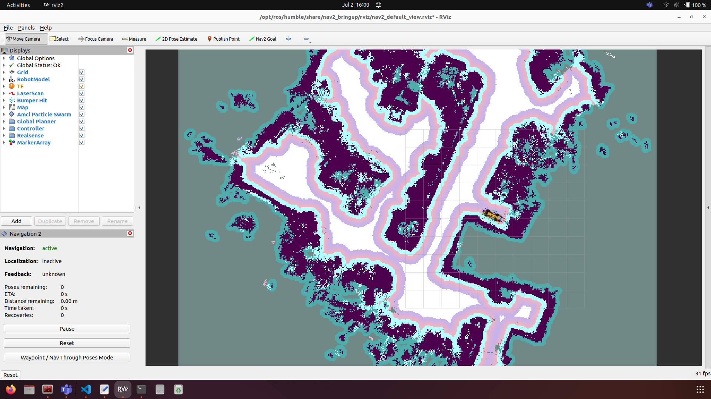
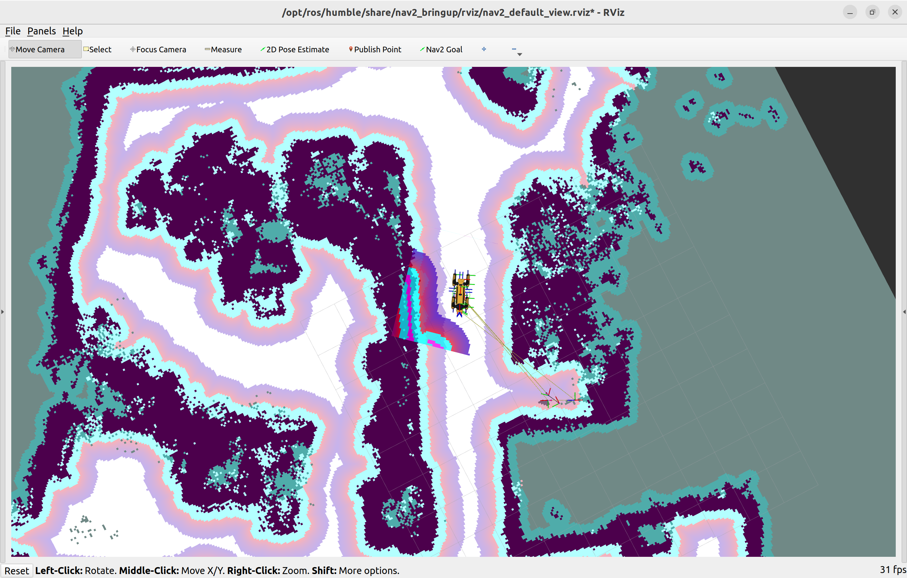
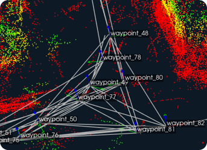
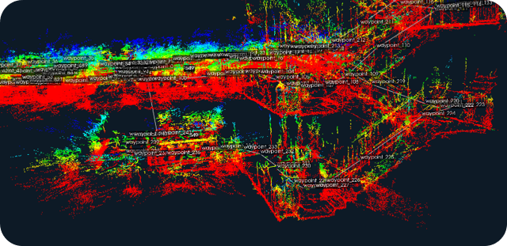

<br><br>
<style>
    .title-page {
        text-align: center;
        margin-top: 200px;
    }
    .title-page h1 {
        font-size: 2.5em;
        font-weight: bold;
    }
    .title-page h2 {
        font-size: 1.5em;
        margin-top: 50px;
    }
    .title-page p {
        font-size: 1.2em;
        margin-top: 30px;
    }
    .title-page .date {
        margin-top: 100px;
        font-size: 1.2em;
    }
</style>

<div class="title-page">
    <h1>Project report: Spot-Perception</h1>
    <h2>Authors</h2>
    <p>Raphael Aberle, Moritz Arntz, Hannes Bornemann, Jürgen Hennig, Eshan Savla</p>
    <h2>Supervisor</h2>
    <p>Prof. Dr.-Ing. Christian Wurll</p>
    <div class="date">
        <p>Date: 27.07.2024</p>
    </div>
</div>
<div style="page-break-after: always;"></div>

# Table of Contents

1. [Quick Start](#1-quick-start)
2. [Hardware and Interfacing](#2-hardware-and-interfacing)
3. [Software architecture](#3-software-architecture)
4. [Configuration of spot ros2 package](#4-configuration-of-spot-ros2-package)
5. [RTAB-Map](#5-rtab-map)
6. [Nav2 Navigation Stack](#6-nav2-navigation-stack)
7. [GraphNav](#7-graphnav)
8. [Troubleshooting](#8-troubleshooting)
<div style="page-break-after: always;"></div>

# Remark

This repository extends the [ROS2 Package for Spot](https://github.com/bdaiinstitute/spot_ros2) by integrating ROS based SLAM and navigation functionalities.

**Important:** As the `humble` branch is outdated and `main` is a rolling release branch, this repository uses a fixed commit to guarantee functionality. This means that newer features of of the Spot ROS2 package might not be available out of the box. However, updating to a newer version of the package is easily possible as long as the config file is updated aptly.

The SLAM package is computationally intensive and requires sufficient processing power to function smoothly. During the develepement of this package, a [NVIDIA Jetson Orin 64gb](https://developer.nvidia.com/embedded/learn/jetson-agx-orin-devkit-user-guide/index.html) was used for edge computing locally on Spot.
<div style="page-break-after: always;"></div>

# 1. Quick Start

This assumes you have configured your hardware correctly with Spot. Refer to the [Hardware Section](#2-hardware-and-interfacing) for more information on configuring and interfacing your hardware directly with spot.

1. Configure the `spot_ros_config.yaml` under configs with your spot username, password and Payload port IP under hostname:

```yaml
username: "user"
password: "password"
hostname: "10.0.0.3"
```

2. Select a name for spot and add it to the entrypoint file under `docker/spot-ros2/entrypoint.sh`. The file looks like this:

```bash
#!/bin/bash
source /opt/ros/$ROS_DISTRO/setup.bash
source /home/robot/spot_ros2_ws/install/setup.bash
export $SPOT_NAME="myspot" # --> HERE
ros2 launch spot_driver spot_driver.launch.py config_file:=./src/spot_ros2/configs/spot_ros_config.yaml spot_name:=$SPOT_NAME publish_point_clouds:=True

```

3. select your preferred odom frame in `spot_ros_config.yaml`under configs using your **SPOT_NAME**:

```yaml
preferred_odom_frame: "myspot/odom" # pass either odom/vision. This frame will become the parent of body in tf2 tree and will be used in odometry topic. https://dev.bostondynamics.com/docs/concepts/geometry_and_frames.html?highlight=frame#frames-in-the-spot-robot-world for more info.
```

4. Pull the latest docker images:
   **Note**: This requires an account at [dockerhub](www.dockerhub.com) and logging on locally on your machine

```bash
docker pull eshansavla0512/ros2-spot-arm64:rework
docker pull eshansavla0512/ros2-rtabmap-arm64:latest
```
<div style="page-break-after: always;"></div>
5. Alternatively, you can build the containers locally on your amd64 machine or on arm64 machine with at least 16gb of RAM

```bash
bash ./build_docker.sh # for build on native arm64 architecture
bash ./build_docker.sh --cross-compile # for emulating arm64 builds on amd64 architecture
```

**Note**: Depending on your internet connection, this can take between 30-60 mins for a fresh build.

6. Running the containers
   To run the containers, just run:

```bash
bash start_docker.sh
```

This will launch the docker compose command which takes care of starting both containers - the spot ros2 driver and slam + nav2 container with the appropriate parameters.

7. Start Navigating with Nav2 on your local machine:
   **Note:** This requires you to locally install ros2 humble and nav2 on your own machine. If you have them installed in a container, run the same command inside your container.

```bash
source /opt/ros/humble/setup.bash
ros2 launch nav2_bringup rviz.launch.py
```

Your screen should look something like this:



**Hint -** You can visualize Spot's model in rviz by selecting the right topic under RobotModel>Description Topic. Details on this can be found in this [section](#navigation-in-rviz)

8. Using the _Nav2 Goal_ option you can click on your goal point and drag your mouse while holding down the left button to provide your goal orientation for spot.
<div style="page-break-after: always;"></div>

# 2. Hardware and Interfacing

## Parts list

In order to copy the subsequent description of the hardware setup, additional parts are required. The following list contains all the parts needed, where some of them are models which need to be 3D-printed.

• [NVIDIA Jetson Orin 64gb](https://developer.nvidia.com/embedded/learn/jetson-agx-orin-devkit-user-guide/index.html)  
• [General Expansion Payload (GXP) module](https://support.bostondynamics.com/s/article/Spot-General-Expansion-Payload-GXP)  
• „jetson-platte.prt“ (3D printed) [(click here to download the 3D model)](models/jetson-platte.stl)  
• „jetson-deckel.prt“ (3D printed) [(click here to download the 3D model)](models/jetson-deckel.stl)  
• 4x threaded inserts M6  
• 4x cylinder head screw M6x80  
• 4x cylinder head screw M5x10  
• 4x washer M6  
• 4x washer M5  
• 6x [T-slot nut](https://de.misumi-ec.com/vona2/detail/110302247820/?HissuCode=HNTR5-5)  
• [15-pin D-SUB male connector](https://www.conrad.de/de/p/tru-components-t1904c098-d-sub-stiftleisten-set-polzahl-15-schrauben-1-st-2108938.html?hk=SEM&WT.mc_id=google_pla&gad_source=1&gclid=CjwKCAjwuJ2xBhA3EiwAMVjkVI6hCHULTX5bZtmSpPjy9u6TFpEu-Qj3K-N-bZPuuvF46AN-jl-E2hoCSQwQAvD_BwE&refresh=true)  
• [power cable](https://www.reichelt.de/adapterkabel-2000-mm-dc-stecker-auf-freies-ende-dc-aks-7521-p150125.html?PROVID=2788&gad_source=1&gclid=EAIaIQobChMIvvSshPrIhQMVigcGAB0KjAioEAQYASABEgK4bfD_BwE)  
• Ethernet cable

## Mount for Jetson

For operating the SLAM package, the [NVIDIA Jetson Orin 64gb](https://developer.nvidia.com/embedded/learn/jetson-agx-orin-devkit-user-guide/index.html) must first be permanently mounted on the robot. Spot has two mounting rails on its back for this purpose, on which such payloads can be mounted using t-nuts. However, the Jetson computer does not have any mounting holes. For this reason, a bracket is designed that fixes the computer from above and below by clamping and can be produced using a 3D printer (see picture below). Threaded inserts are melted into the plastic in the lower part in order to securely clamp Jetson with four screws in the corners. The recess in the upper part is positioned above the fan location to ensure that it operates seamlessly. The unit is mounted on Spot using a further four screws in the base plate.


## Power supply and data communication interface

Jetson must be supplied with power and connected correctly to the spot core to ensure communication between the systems. To connect such external devices, Boston Dynamics offers the [General Expansion Payload (GXP) module](https://support.bostondynamics.com/s/article/Spot-General-Expansion-Payload-GXP). This is also screwed onto the mounting rails and connected to the front of the two DB25 sockets. A regulated power supply can then be tapped from the GXP module using an [15-pin D-SUB male connector](https://www.conrad.de/de/p/tru-components-t1904c098-d-sub-stiftleisten-set-polzahl-15-schrauben-1-st-2108938.html?hk=SEM&WT.mc_id=google_pla&gad_source=1&gclid=CjwKCAjwuJ2xBhA3EiwAMVjkVI6hCHULTX5bZtmSpPjy9u6TFpEu-Qj3K-N-bZPuuvF46AN-jl-E2hoCSQwQAvD_BwE&refresh=true). The table below shows which pins to use for connection. We chose pins 13 (+24V) and 1 (GND) for a supply voltage of 24 V (max. 150 W).


The data connection is made via an Ethernet cable, which is simply connected to the GXP bridge. The figure beneath shows the connected and mounted Jetson on Spot.


## Add payload in web interface for collision avoiding

When adding payloads on top of spot, the internal collision avoiding system does not automatically take this into account while path planning. For example Spot can walk under tables with nothing attached, but when the Jetson is mounted on its back, he has to crouch to not collide. Therefor these additional obstructions have to get added to the kinematic structure to make the algorithm consider them. In order to do this, the following steps are required.

### Step 1: Connect to Spots WIFI

On Spots belly you can find Spots "Default Network information" (See picture below). Connect your computer to spots WIFI SSID, in our this case it is "spot-BD-31580012". You can find the WIFI password on the sticker as well.


### Step 2: login to the spot configuration page

On the sticker from "step 1" you can also find the login credentials for the spot configuration page.

- open your browser and search for "192.168.80.3"
- a page saying "Sign in to TurboDoggy" should open. Sign in witth the "Admin" credentials from the sticker.


<div style="page-break-after: always;"></div>


### Step 3:

- On the menu bar on the right, select "Add payload"
- This screen shows you all payloads added so far. Select "Add payload" again to subjoin another one.


### Step 4:

This Step is to configure the new payload:

- add a name and a description:


<div style="page-break-after: always;"></div>

- add a position and orientation of the payloads reference frame. Also add the payloads weight:


- define the position of the center of mass and the dimensions of the square bounding box representing the the payload:


<div style="page-break-after: always;"></div>

- you should find a visualization of your payload configuration on the end of the page:


<div style="page-break-after: always;"></div>

# 3. Software architecture

## Software-Architecture

This section details the software architecture for the spot-navigation package. The following image depicts the overarching interfacing between the individual software components:
To add an image in a markdown file, you can use the following syntax:


### Spot ROS-2

To achieve motion control of Spot mini via ROS the [ROS-2 driver](https://github.com/bdaiinstitute/spot_ros2) can be utilized. Within this package, all the necessary services, topics and actions to teleoperate or navigate with Spot Mini can be found. It also offers functionalities to interface with the different payloads offered for Spot Mini. It is important to note however, that SpotCAM has certain known issues which makes using it within the Spot ROS-2 Driver difficult. More information on how to set up this package can be found under the dedicated [Spot ROS-2 Section](#ros-2-driver-spot)

Despite being still under development, this package also offers access to Spot's internal mapping and navigation tool GraphNav. This allows for ROS independent mapping and multi-storey navigation. To incorporate this functionality into ROS, a [fork](https://github.com/Banane01/spot_ros2) of the original Spot ROS-2 driver was created
<div style="page-break-after: always;"></div>

### RTAB-Map

The [RTAB-Map ROS-2 Package](https://github.com/introlab/rtabmap_ros/tree/ros2) provides SLAM functionalities in 3D to be used in cohort with a robot navigation stack. In addition to creating a 2D planar costmap of a location, it registers its surroundings in 3D, creating a point cloud of the environment and adjusting it along with the global costmap. This package is utilized to provide fully ROS native SLAM functionality.

In addition to creating the global costmap, the RTAB-Map package also offers the functionality to visually detect obstacles in the form of point clouds, which can be utilized to create a local costmap around Spot.

### Nav-2 Navigation Stack

The [Nav-2](https://docs.nav2.org/) provides ROS native planar navigation and path planning functionalities for mobile robots. This package can be used in tandem with Rviz to provide an easy and intuitive way to navigate Spot Mini within a mapped environment.

## Docker

Each of the packages listed above have been packaged in docker containers to manage dependencies and provide ease of use, ensuring system specific setups and configurations do not interfere with the functions of the packages. For now, the docker containers are only provided for the arm64-v8 processor architecture, as an NVIDIA Jetson Orin Developer Kit was utilized for local edge computing. By connecting user devices to the same network as the Jetson and using the same ROS-Domain ID, it is possible to interface with these packages and access their functionalities remotely.

### Spot Driver Docker

The docker image for the spot driver is based off a ROS image for arm64-v8 and installs all the necessary ROS dependencies before moving on to clone and install the forked version of the spot ROS-2 Driver as mentioned in this [section](#spot-ros-2).

### RTAB-Map + Nav2 Docker

This docker image packages both the ROS wrapper for RTAB-Map and the Nav2 package in one. As this is based off of the official docker image for RTAB-Map, it can be installed for an amd64 or arm64 architecture by using cross compilation provided within docker's build functionality.

### Building and starting the containers

For ease of use, both images have been packaged within a docker-compose file, ensuring they can be built with the correct prerequisites and also started with the right flags to ensure full functionality.

Building:
Execute the following command from within the root of the repository.

```bash
bash build_docker.sh # If building natively on arm64
```
<div style="page-break-after: always;"></div>


```bash
bash build_docker.sh --cross-compile # Cross compiling for arm64 on other host architectures
```

For details on the structure, refer to the Dockerfiles.
<div style="page-break-after: always;"></div>

# 4. Configuration of spot ros2 package

## ROS-2 Driver Spot

This section details all the necessary configuration steps for setting up the ROS-2 Driver for Spot Mini to work correctly and interface with other ROS packages.

### Installing the driver:

Alternatively to running the driver on an edge computer locally on Spot Mini, the driver can be installed on seperate host device and run, as long as the device is physically connected to Spot via the Ethernet port or Spot's direct wifi connection. Details on the exact installation process and installation from source can be found on the GitHub page for the driver.

In a gist, the driver can be installed as follows, assuming ROS-2 is already installed on the machine.

```bash
$ git clone https://github.com/bdaiinstitute/spot_ros2.git

cd spot_ros2
git submodule init
git submodule update
```

To install all dependencies for this driver, the bundled script can be used. Depending on which processor architecture is being used (amd64 or arm64), the appropriate flag needs to be provided as follows:

```bash
cd <path to spot_ros2>
./install_spot_ros2.sh
or
./install_spot_ros2.sh --arm64
```

Next, the ROS-2 workspace needs to be built:

```bash
cd <ros2 ws>
source /opt/ros/humble/setup.bash
colcon build --symlink-install --packages-ignore proto2ros_tests
source install/local_setup.bash
```
<div style="page-break-after: always;"></div>

#### Starting the driver after installation:

The general command used to start the driver can be used as follows:

```bash
ros2 launch spot_driver spot_driver.launch.py [config_file:=<path/to/config.yaml>] [spot_name:=<Robot Name>] [publish_point_clouds:=<True|False>] [launch_rviz:=<True|False>] [uncompress_images:=<True|False>] [publish_compressed_images:=<True|False>]
```

Details on configuring the driver can be found in the next [section](#configuring-the-driver)

### Configuring the driver:

To configure the Spot ROS-2 Driver with the correct parameters a YAML file is utilized. Highlighted below are certain crucial parameters which need to be set to ensure correct functioning of the driver:

```yaml
username: # Required to access Spot-SDK
password:
hostname: #IP of payload port or spot wifi
```

The username and password are provided with Spot and need to be input into the yaml file

The hostname is necessary to allow communication with Spot`s internal computer and is also the channel through which outputs such as point clouds and images will be streamed.

```yaml
preferred_odom_frame: hkaspot/odom # example. If spot-name provided, it needs to be included like this
```

The preferred odometery frame has to be provided, which will also be used in the mapping and navigation section. For additional information on the choice of odometery available for spot, refer to: https://dev.bostondynamics.com/docs/concepts/geometry_and_frames.html?highlight=frame#frames-in-the-spot-robot-world

Details on additional parameters can be found under the official documentation for the driver under the respective GitHub page.

The driver is started directly within the docker container when it is booted. For more information on the exact start command, refer to the respective entrypoint file under docker/spot-ros2.

<div style="page-break-after: always;"></div>

#### Visualizing the ouputs of Spot's depth cameras

It is possible to visualize the outputs of Spot's depth cameras using Rviz. Start Rviz on the Jetson or on the local machine with a ROS-2 Installation connected to the same network and having the same domain id.

```bash
export $ROS_DOMAIN_ID=33
echo $ROS_DOMAIN_ID # Ensure Domain ID is set
rviz2 # Start Rviz
```

Once started, select the config file `spot.rviz`under configs using file>open. This should load all the necessary topics to visualize the outputs from the depth camera.
<div style="page-break-after: always;"></div>

# 5. RTAB-Map

RTAB-Map (Real-Time Appearance-Based Mapping) is an RGB-D Graph SLAM (Simultaneous Localization and Mapping) method for map recording that utilizes a global Bayesian loop closure detector. This detector employs a bag-of-words approach to assess the likelihood of whether a new image corresponds to a previously visited location or a new one. When a loop closure hypothesis is confirmed, a new constraint is introduced into the map's graph, and a graph optimizer works to minimize errors in the map. A memory management strategy is implemented to restrict the number of locations used for loop closure detection and graph optimization, ensuring that real-time performance is maintained even in large-scale environments.

The documentation and a few tutorials for RTAB-Map can be found on the following page: [RTAB-Map ROS Wiki](http://wiki.ros.org/rtabmap_ros/noetic_and_newer)


## Overview of architecture

Using RTAB-Map within this package enables the capability to map environments using the depth cameras integrated into Spot mini. The decision to use RTAB-Map was made because nav2 Navigation Stack does not support depth cameras as sensor inputs and RTAB-Map allows for 3D mapping. This 3D mapping capability holds greater potential for navigating Spot mini in multi-story buildings. RTAB-Map supports integrating various sensors and odometry sources for mapping. Additionally, RTAB-Map provides tools to optimize recorded maps to enhance navigation and can also operate as a navigation instance providing the optimized map to the nav2 Navigation Stack.


## Installation and Configuration of RTAB-Map

RTAB-Map can be installed as an apt package with the following command:

```bash
sudo apt install ros-$ROS_DISTRO-rtabmap-ros
```

Following the installation, the package should be configured for use with Spot mini in `entrypoint.sh`. The following lines are responsible for starting the RTAB-Map package. Only the following arguments should be passed. Additional arguments may compromise the smooth operation with Spot mini.

```bash
ros2 launch rtabmap_launch rtabmap.launch.py \
    rgb_topic:=/hkaspot/camera/back/image \
    depth_topic:=/hkaspot/depth_registered/back/image \
    camera_info_topic:=/hkaspot/camera/back/camera_info \
    database_path:=/home/robot/spot-perception/map/rtabmap_copy.db \
    odom_frame_id:=hkaspot/odom \
    odom_topic:=/hkaspot/odometry \
    visual_odometry:=false \
    frame_id:=hkaspot/body \
    subscribe_depth:=false \
    subscribe_rgbd:=false \
    rgbd_sync:=true \
    approx_sync:=true \
    queue_size:=1000 \
    qos:=1 \
    rviz:=true \
    rtabmap_viz:=true \
    localization:=true
```

Below, the entries of the entrypoint are further explained.

### Camera Information

```bash
rgb_topic:=/hkaspot/camera/back/image \
```

Here, the corresponding camera topic is passed to RTAB-Map. Spot mini has five depth cameras positioned at various locations. At the time of this project, RTAB-Map supports recording with only one camera signal, so not all five cameras can be used. Due to the fact that the raw data from the two front cameras are rotated by 90 degrees, the rear camera is chosen here. Since the robot's odometry is also used for recording, this orientation does not affect its navigation.

```bash
depth_topic:=/hkaspot/depth_registered/back/image \
```

This topic is used to pass depth data to RTAB-Map. Depth data and RGB data are synchronized with the following line.

```bash
rgbd_sync:=true \
```

The following line should be used to pass camera information to RTAB-Map in order to correctly create point clouds:

```bash
camera_info_topic:=/hkaspot/camera/back/camera_info \
```

### Orientation and Odometry

For mapping, odometry is necessary to continuously track the robot's position and orientation. This can be achieved in two ways. Firstly, RTAB-Map can determine odometry directly from the provided image data. Secondly, if available, the robot's odometry information can be directly fed into RTAB-Map.

The determination of odometry via the camera images is only recommended as long as the environment has a lot of visual structure and features. If this is not the case, RTAB-Map will not be able to continuously calculate the odometry (also shown in the visualisation) and the odometry data of the robot should be used for this. As these are available via the Ros driver for Spot mini, this has been done here. The topic for the odometry is set in the following line:

```bash
odom_topic:=/hkaspot/odometry \
```
<div style="page-break-after: always;"></div>

The frame in which the odometry data is given should also be set:

```bash
odom_frame_id:=hkaspot/odom \
```

In addition, the calculation of visual odometries from the camera data must be explicitly deactivated:

```bash
visual_odometry:=false \
```

The frame ID in which the map is recorded must also be configured:

```bash
frame_id:=hkaspot/body \
```

### Vizualization via RTAB-Tool and RViz

To record the map, you can start your own visualisation provided by RTAB-Map as well as RViz:

```bash
rviz:=true
```

```bash
rviz:=false
```

The image below shows the RTAB-Map visualisation tool. In the right half, the map created in 3D and the path of Spot mini can be viewed. The left half provides information on loop closure detection and odometry.


Loop Closure Detection checks whether locations that have already passed can be recognised. If this is the case, the odometry data is matched, which can lead to a better-resolved map in terms of position and orientation.

The odometry window should never appear dark red if the odometry data is fed in directly. If this is the case, the visualisation indicates that the odometry could not be calculated from the image data at this time, which consequently suggests that the odometry data of the robot is not being used, which can lead to some inaccuracies depending on the environment.

Parallel to the visualisation of RTAB-Map itself, the map can also be viewed in RViz parallel to the recording.


RViz is automatically started correctly configured. The three-dimensional map can also be seen as a point cloud. The paths already travelled are also shown here. Below the point cloud on one level, you can also see the two-dimensional map, which you can then navigate through using nav2 Navigation Stack.

### Saving of Map (Database)

The storage path for the database should be configured with this entry both for recording the map and for navigation:

```bash
database_path:=/home/robot/spot-perception/map/rtabmap_copy.db \
```

As the application runs in Docker containers, this file path should also be mounted externally on the PC!

### Mapping or Navigation mode

As already mentioned in Overview, RTAB-Map should also be started for navigation in a map. To record a map itself, the following launch parameter should be set to FALSE:

```bash
localization:=false
```

For navigation with nav2 Navigation Stack, RTAB-Map provides the map and the localization of the Spot mini. The parameter should then be set to TRUE:

```bash
localization:=true
```

All other launch parameters should also be set as shown in the extract above.

<div style="page-break-after: always;"></div>

## Recording of Map

To record a map, the container should be started with the following configuration in ‘entrypoint.sh’:

```bash
ros2 launch rtabmap_launch rtabmap.launch.py \
    rgb_topic:=/hkaspot/camera/back/image \
    depth_topic:=/hkaspot/depth_registered/back/image \
    camera_info_topic:=/hkaspot/camera/back/camera_info \
    database_path:=/home/robot/spot-perception/map/rtabmap_copy.db \
    odom_frame_id:=hkaspot/odom \
    odom_topic:=/hkaspot/odometry \
    visual_odometry:=false \
    frame_id:=hkaspot/body \
    subscribe_depth:=false \
    subscribe_rgbd:=false \
    rgbd_sync:=true \
    approx_sync:=true \
    queue_size:=1000 \
    qos:=1 \
    rviz:=true \
    rtabmap_viz:=true \
    localization:=false
```

As you can see, localization has been deactivated so that RTAB-Map starts in mapping mode. RViz and the RTAB-Map visualisation should now start. Recording is then already active.

To record, Spot mini should be controlled manually using the Boston Dynamics remote control. The map should now be three-dimensional in both visualisations.

Due to the rather low resolution of the Spot internal cameras of 640x480, the robot should not be moved too quickly. It can also be useful to rotate the robot at various points. This allows more image data to be taken into account when creating the map. Care should also be taken to ensure that the robot moves smoothly and experiences few vibrations, as these can affect the accuracy of the odometry data and thus cause errors in the localization on the map.

The database for the map is constantly updated during recording. Nevertheless, it is advisable to save the map again at the end using the RTAB map visualisation.

<div style="page-break-after: always;"></div>

## Navigation

As already mentioned, path planning and navigation is handled by nav2 Navigation Stack. However, an instance of RTAB-Map must be started so that the map is made available to nav2 via a topic. To do this, the entry in ‘entrypoint.sh’ must be configured as follows:

```bash
ros2 launch rtabmap_launch rtabmap.launch.py \
    rgb_topic:=/hkaspot/camera/back/image \
    depth_topic:=/hkaspot/depth_registered/back/image \
    camera_info_topic:=/hkaspot/camera/back/camera_info \
    database_path:=/home/robot/spot-perception/map/rtabmap_copy.db \
    odom_frame_id:=hkaspot/odom \
    odom_topic:=/hkaspot/odometry \
    visual_odometry:=false \
    frame_id:=hkaspot/body \
    subscribe_depth:=false \
    subscribe_rgbd:=false \
    rgbd_sync:=true \
    approx_sync:=true \
    queue_size:=1000 \
    qos:=1 \
    rviz:=true \
    rtabmap_viz:=true \
    localization:=true
```

This starts RTAB-Map in localization mode. As the navigation of Spot mini takes place via a separate computer in the same network anyway, no visualization needs to be started directly on the Jetson. For this reason, RViz and RTABMap_Viz are both set to FALSE. The configuration of Localization to TRUE is crucial. Only then will RTAB-Map be started in localization mode and no map will be recorded.

## Subsequent optimization of the map

RTAB-Map already offers another tool, rtabmap-databaseViewer, for subsequent optimisation of the map after recording.

The application can be started with the following command. The path belonging to the map must be specified.

```bash
rtabmap-databaseViewer /home/robot/spot-perception/map/rtabmap_copy.db
```

The Database Viewer opens, as shown in the following illustration:


This tool can be used to view and customise all the images contained in the map. Via Edit > Detect more loop closures, the entire data set is looked through again and optically identical points are found that can close the nodes in the map.

### Optimization of 2D map

Since only the 2D map will be used for navigation with the nav2 Navigation Stack in a later step, this map can also be adjusted and edited here. To do this, the map can be opened in a new window via Edit -> Optimize 2D map, as shown below.


Here, you can right-click to choose whether to add an obstacle or delete an obstacle. Then, by pressing the left mouse button, you can modify or redraw the map. This step can be particularly helpful when dealing with low-resolution cameras. Often, the 2D map contains individual points that are stored as obstacles, even though there is actually none. These points can then be retouched using this tool, allowing the robot to pass through the corresponding area.

### Save the optimized map


As shown above, the optimized map should then be exported and saved via File -> Export, so that the changes take effect.

### Additional settings for local costmaps

The RTAB-Map package also provides functionalities to detect obstacles by segmenting input point clouds to differentiate between the ground and obstacles. These are required to achieve full functionality within local costmaps detailed in the [section](#using-local-costmaps) for Nav2.

The relevant commands to start the nodes can be found in the entrypoint file under docker/rtab-map/entrypoint.sh. The following highlights relevant information about these commands:

The command below converts depth images to point clouds. The topic depth/image is remapped to the appropriate topic for depth images from Spot. Camera intrinsics also need to be provided to convert depth values to point clouds

```bash
$ ros2 run rtabmap_util point_cloud_xyz --ros-args -r depth/image:=/hkaspot/depth_registered/frontleft/image -r depth/camera_info:=/hkaspot/depth_registered/frontleft/camera_info -p voxel_size:=0.05 -p decimation:=4 -p max_depth:=10.0 -p approx_sync:=false
```

The command below is relevant for obstacle detection and requires two parameters, which are listed in the command below. They can remain unchanged, unless the robot name has been defined differently in the Spot ROS-2 Driver.

```bash
$ ros2 run rtabmap_util obstacles_detection --ros-args -p frame_id:=hkaspot/body -p map_frame_id:=map
```
<div style="page-break-after: always;"></div>

# 6. Nav2 Navigation Stack

Nav2 is the successor to the ROS Navigation Stack. It enables mobile robots to navigate through complex environments and perform custom tasks with nearly any type of robot kinematics.
Nav2 can not only move from Point A to Point B but also handle intermediate waypoints. It provides functions for perception, planning, control, localization, and visualization.
It creates an environmental model from sensor and semantic data, dynamically plans paths, calculates motor commands, avoids obstacles, and structures higher-level robot behaviors.
As output, Nav2 provides valid velocity commands for the robot's motors.

## Installation

To control the robot from a PC using Nav2, it is necessary to install Nav2 on the PC. Installation can be carried out using the guide from the following link:
[Nav2 Installation Guide](https://docs.nav2.org/getting_started/index.html)

## Configuration

To enable Nav2 to communicate with the Spot Mini, it is necessary to adjust some configurations in the Nav2 parameter file. The file can be found in the project at the following path:

`spot-perception/configs/nav2_params.yaml`

Since the Spot Mini uses different naming conventions than those used by Nav2 by default, the following lines in the parameter file need to be adjusted to match the naming conventions of the Spot Mini.
The parameters to be adjusted describe the assignment of `base_frame`, `global_frame`, `local_frame`, and the Odometry topic of the spot for nav2:

```yaml
44  robot_base_frame: hkaspot/body
45  odom_topic: hkaspot/odometry
190 global_frame: hkaspot/odom
191 robot_base_frame: hkaspot/body
227 robot_base_frame: hkaspot/body
306 local_frame: hkaspot/odom
308 robot_base_frame: hkaspot/body
335 odom_topic: "hkaspot/odometry"
342 base_frame_id: "hkaspot/body"
343 odom_frame_id: "hkaspot/odom"
```
<div style="page-break-after: always;"></div>

Additionally, it is important to note that the plugin assignment in the parameter file uses `/` instead of `::` as originally included. The relevant lines are listed below:

```yaml
274	plugin: "nav2_navfn_planner/NavfnPlanner"
297 	plugin: "nav2_behaviors/Spin"
299	plugin: "nav2_behaviors/BackUp"
301	plugin: "nav2_behaviors/DriveOnHeading"
303	plugin: "nav2_behaviors/Wait"
305  plugin: "nav2_behaviors/AssistedTeleop"
```

With the start of the RTAB-Map Docker, Nav2 is launched with the adjusted `nav2_params.yaml` through the following line in the entrypoint.

`ros2 launch nav2_bringup navigation_launch.py params_file:=spot-perception/configs/nav2_params.yaml`

## Remapping

To ensure that the velocity commands output by Nav2 are received by the Spot, additional topic remappings from Nav2 to the Spot's topic need to be applied. This must be done in the `navigation_launch.py` file at the following path.

`spot-perception/launch/navigation_launch.py`

The following lines need to be adjusted for this:

```yaml
135	remappings=remappings + [('cmd_vel', 'hkaspot/cmd_vel')],
168	remappings=remappings + [('cmd_vel', 'hkaspot/cmd_vel')],
202	remappings=remappings + [('cmd_vel', 'hkaspot/cmd_vel')],
238	remappings=remappings + [('cmd_vel', 'hkaspot/cmd_vel')],
259	remappings=remappings + [('cmd_vel', 'hkaspot/cmd_vel')],
```

## Navigation in RViz

Once the Docker is started, the Spot Mini can be controlled from an external PC using RViz. The following requirements must be met:

1. The PC and the Jetson must be on the same network. The network `ILKA-RoboLab2` can be used for this purpose.
2. The ROS Domain ID of the PC must match that of the Jetson.

To change the ROS Domain ID on the PC, execute the following command in the terminal:

```bash
export ROS_DOMAIN_ID=33
```

To check the ROS Domain ID, use the following command:

```bash
echo $ROS_DOMAIN_ID
```

Then, RViz can be started on the PC using the following command in the terminal:

```bash
ros2 launch nav2_bringup rviz_launch.py
```

RViz should then open on the PC as shown below:


The following settings should be present on the left side under Display.

.png>)
.png>)

To control the Spot via RViz, ensure that the topics for `Description`, `Topic`, and `Update Topic` match the topics shown in the images.

To navigate, use the `Nav2 Goal`, which can be found in the selection at the top center. To set a goal, click on the Nav2 Goal selection with the left mouse button and draw a direction arrow on the map while holding down the mouse button. This arrow indicates the desired orientation of the Spot when it arrives at the destination.

It is important to select only white or light-colored areas on the map for navigation, as dark areas represent obstacles. The map shown was taken in the laboratory (ground floor) at LTC.

Once a reachable goal is selected on the map, Nav2 begins planning the path to that goal point. The planned path will be drawn on the map, as shown in the following figure.

.png>)

After a short time, the Spot will start moving towards the selected goal point. During navigation, the Spot's position will be continuously updated on the map. Additionally, feedback on the current state of navigation will be displayed in RViz in the following window:

.png>)

Since the Spot's localization is done via its odometry and not through Nav2, the Localization status in the RViz window is shown as `inactive`, as seen in the image.

<div style="page-break-after: always;"></div>

## Using local costmaps

While Spot has inbuilt collision detection and avoidance, a similar functionality can be achieved using ROS native local costmaps in Nav2. This requires some additional setup in RTAB-Map to recognise and publish obstacles. Details on that can be found in this [section](#additional-settings-for-local-costmaps)

Configuring local costmaps in nav2 for Spot is made easier in this repository. If this functionality is desired, it can be easily enabled in the Nav2 config file under configs/nav2_params.yaml

The following is a short description of all relevant parameters for the local costmap:

```yaml
190 global_frame: hkaspot/odom # provide odom frame
191 robot_base_frame: hkaspot/body # consider robot name
193 width: 3 # width of costmap frame
194 height: 3 # height of costmap frame
200 cost_scaling_factor: 2.0 # scale cost severity
201 inflation_radius: 0.70 # Inflate obstacle scale
202 obstacle_layer:
204  enabled: False # Set True to enable local costmap
207    topic: /obstacles # topic containing obstacles
212    raytrace_max_range: 10.0 # max distance
214    obstacle_max_range: 5.0 # obstacle render distance
```



Further details on these and other parameters relevant for costmaps can be obtained [here](https://docs.nav2.org/configuration/packages/configuring-costmaps.html)
<div style="page-break-after: always;"></div>

# 7. GraphNav
## Overview

GraphNav is a navigation system developed by Boston Dynamics, primarily designed for their robotic platforms like Spot. GraphNav enables these robots to navigate complex environments autonomously by creating and utilizing 3D maps. It consists of the following main functionalities:
- Mapping
- Localization
- Navigation

### 3D Mapping

The robot creates detailed 3D maps of its environment with it's depth-cameras.
GraphNav is a graph-based method for map generation and navigation.
Waypoints are the nodes in the graph and contain spatial information as a point cloud.
The edges between waypoints contain the relative transformation of the poses of different waypoints. They can also save the information, whether spot should navigate in stair-mode between two nodes or allow the navigation only in one direction. Below you can see an exaple of a map, which allows the robot to navigate in GraphNav.


### Localization
Once the map is created, the robot can determine its position within that map, allowing it to navigate accurately. For localization the robot can estimate its position using a fiducial or a predefined waypoint. Therefore the fiducial or the selected waypoint have to be part of the map. 

### Navigation
GraphNav allows robots to plan optimal paths from one point to another within the mapped environment. For navigation it calucaltes the shortest path. 
It can detect and navigate around obstacles that may not have been present during the initial mapping. It will automatically return to the graph after the obstacle has passed.

<div style="page-break-after: always;"></div>

## Setup SpotSDK

GraphNav is part of the SpotSDK, therefore the SpotSDK has to be installed to be able to record a map. If you only want to navigate with Spot using a recorded map, you don't have to install it, as the navigation is integrated into ROS2.


1. [Install SpotSDK](https://dev.bostondynamics.com/docs/python/quickstart.htmle) via pip for python

2. Clone the SDKRepo for access to the examples
```shell
git clone https://github.com/boston-dynamics/spot-sdk.git
cd spot-sdk
```
3. Navigate to recording_command_line example
```shell
cd python/examples/graph_nav_command_line
```
4. Install missing dependencies for the map-recoding-tool via pip
```shell
python3 -m pip install -r requirements.txt
```

## Map Recording
1. Start the robot and enable motor-power with the tablet

    **Hints:**
    - *Before you start, make sure that the robot is in a location where it can see a fiducial. Later, the robot will use this fiducial to initialize its position to the map.*
    - *Let the robot undock, before starting to record a map. Otherwise the first waypoint is set on the docking station which can lead to bad behaviour if spot tries to reach a waypoint which is on the docking station.*

2. Access to spots internal wifi with your device

3. Start the map-recording-tool  (ROBOT_IP: 192.168.80.3)
```shell
python3 -m recording_command_line --download-filepath <path_to_downloaded_map> ROBOT_IP
```
4. Start recording a map by pressing (1) in the command-line-tool

5. Navigate spot with the tablet to generate a map 

    **Hints:**
    - *Do not create any default waypoints if you want to use GraphNav within ROS2 cause the default version of Spot Wrapper is not able to read these waypoints correctly*

6. For more deatailed usage read the [tool-description](https://dev.bostondynamics.com/python/examples/graph_nav_command_line/readme)


### Optimize map
The map is created as a path for the robot to follow. By default, only the waypoints between the robot directly navigated are connected. To achieve better flexibility, a series of optimisation steps can be carried out in the command-line tool.

    (7) Create new edge between existing waypoints using odometry.
    (8) Create new edge from last waypoint to first waypoint using odometry.
    (9) Automatically find and close loops.

These steps will increase the numbers of edges in the graph as you can see in the figure below. We recommand to do optimization 7 and 9 in every recording and optimization 8 only if the start and the end of the recording is the same.



The next optimization step is recommended if you have huge deviations in the position of places the robot already visited. The following figure shows the same floor that was recorded at the beginning and after the robot had travelled through the different floors. The optimization tries to match the spatial information. This optimisation is particularly recommended for a map with floor changes.

    (a) Optimize the map's anchoring.




If the map wasn't directly recorded via spot's Jetson, copy the whole folder of the downloaded graph and send it to spot's Jetson.

## View Map
To view the recorded map follow the following steps:

1. Navigate to view_map example in the spot-sdk
```shell
cd python/examples/graph_nav_view_map
```

2. Start the map-viewer-tool
```shell
python3 -m view_map <path_to_your_map_directory>
```

## Setup ROS-Driver for Navigation
Theoretically, the standard spot-ros2-driver should be capable of handling the navigation of GraphNav.
Practically, the driver was not well tested for navigation with GraphNav and the functionallity for navigation did not work out of the box with the driver because of some bugs.
Therefore, we created a new repository which handles some of the bugs and enables the opportunity to navigate to waypoints using GraphNav.
The updated version of the spot-ros2-driver is automatically installed in the docker container.

<div style="page-break-after: always;"></div>

## Navigation

For navigation with GraphNav we provide an example program that allows the robot to automatically wake up, stand up and navigate to a defined waypoint. You can find the example `spot_navigation_client.py` in the spot_examples directory of our modified spot-ros2-driver package.

Before you are able to run the example make sure that the recorded graph is loaded and if not, clear the current graph and upload the new graph like this or call it via rqt:

 ```shell
ros2 service call /hkaspot/graph_nav_clear_graph spot_msgs/srv/GraphNavClearGraph
```
 ```shell
ros2 service call /hkaspot/graph_nav_upload_graph spot_msgs/srv/UploadGraph "{upload_filepath: '<path_to_downloaded_map>'}"
```

By the next service call, you can list all available waypoints in the current graph. Notice that if you leave the parameter empty you will get a list of waypoints from the actual loaded graph.
 ```shell
ros2 service call /hkaspot/list_graph spot_msgs/srv/ListGraph "{upload_filepath: '<path_to_downloaded_map>'}"
```
By running this service you will notice that the response is a list of strings with waypoint-ids like: *hammy-skink-iKQI6hGQ.fCBWXJy6mmjqg==*. These are the waypoints the robot is able to navigate to. Because this waypoints are a bit confusiong and don't fit to the waypoint-ids shown in the graph-viewer our approach was it to translate these waypoint-ids to match the numbers in the map-viewer.

First, we integrated the service call *list_graph* into our code and then noticed that the localisation of the robot was lost in the process. This is probably due to a small bug in the spot driver that could not be solved. As a workaround, the user must manually pass the list of waypoints as a parameter in order to be able to navigate to the direct waypoint numbers from the map-viewer.

### Parameters
- `--robot` (str, required): 
  The hostname of the robot. This parameter is required.

- `--navigate_to` (int, default: `0`): 
  The index of the waypoint to which the robot should navigate.

- `--initialize_position`: 
  A flag to indicate whether the robot's position should be initialized.

- `--upload_path` (str, default: `/home/robot/spot_map/downloaded_graph`): 
  The path to the navigation graph to be uploaded.

- `--initial_localization_fiducial`: 
  A flag to indicate whether fiducials (markers) should be used for initial localization.

- `--initial_localization_waypoint` (str, default: `""`): 
  The waypoint ID to be used for initial localization. This parameter is used if `initial_localization_fiducial` is not set.

- `--waypoint_ids` (list[str], required): 
  A list of waypoint IDs for navigation. This parameter is required.

### Run the program

The following example shows the call for navigation to the waypoint *flinty-mammut-N9z2R+TFjG.2TeF4H5u1Tw==* with a position initialization realtiv to the aruco marker:
 ```shell
ros2 run spot_examples navigate_to --robot hkaspot --navigate_to 2 --initialize_position --initial_localization_fiducial --waypoint_ids ['token-leech-fGv1S4QdSIiNaNNvHzfOiw==', 'wordy-ocelot-ChL0Cc2hzFzSQBVTdOWkDQ==', 'flinty-mammut-N9z2R+TFjG.2TeF4H5u1Tw==', 'dapper-kudu-9HLPTOgq7oS0GxX90nuCFQ=='] 
```
<div style="page-break-after: always;"></div>

# 8. Troubleshooting

## Connection to robot fails when starting spot-ros2-driver

If the spot-ros2-driver is unable to start, because of a failed connection to their robot, check the following steps:

1. Check the hardware connections, especially the ethernet cable connection
2. Check the system time and date of the Jetson. If the mismatch between the system time and the actual time is too big, the driver is unable to connect.
3. If system time is out of date, update it in the settings

## Localization or mapping problems

If you encounter any problems while recording a new map via RTAB-Map or you encounter localization problems, have a look on the RTAB-viewer. If the viewer flashes repeatedly dark red, the robot's odometry is lost. Before you record a map, check whether the odometry is received correctly and if not so, try to restart the container.

## ROS network problems

If you try to access to ROS2 nodes from the spot-ros2-driver from another computer but can't see any ROS2 nodes or topics, check the following steps:

1. Check whether the `ROS_DOMAIN_ID` of your current terminal is equal to `33`
 ```shell
echo $ROS_DOMAIN_ID 
```
If it doesn't, run:
 ```shell
export $ROS_DOMAIN_ID=33
```
2. Check the status of the firewall on Jetson's ubuntu
 ```shell
sudo ufw status
```
If status is active, disable it by:
 ```shell
sudo ufw disable
```