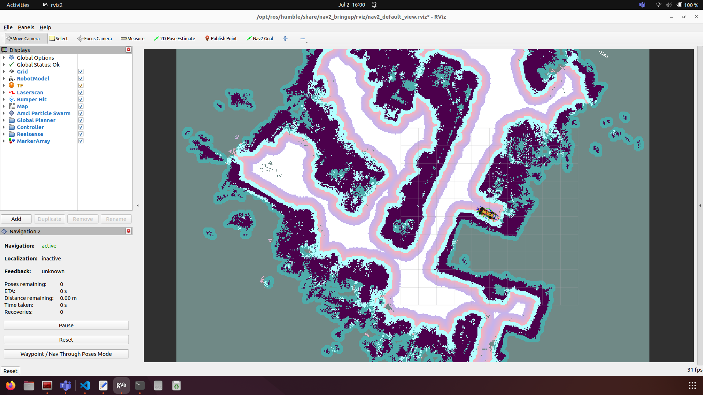

# Nav2 Navigation Stack

Nav2 is the successor to the ROS Navigation Stack. It enables mobile robots to navigate through complex environments and perform custom tasks with nearly any type of robot kinematics.
Nav2 can not only move from Point A to Point B but also handle intermediate waypoints. It provides functions for perception, planning, control, localization, and visualization.
It creates an environmental model from sensor and semantic data, dynamically plans paths, calculates motor commands, avoids obstacles, and structures higher-level robot behaviors.
As output, Nav2 provides valid velocity commands for the robot's motors.

## 1. **Installation**

To control the robot from a PC using Nav2, it is necessary to install Nav2 on the PC. Installation can be carried out using the guide from the following link:

[Nav2 Installation Guide](https://docs.nav2.org/getting_started/index.html)


## 2. **Configuration**

To enable Nav2 to communicate with the Spot Mini, it is necessary to adjust some configurations in the Nav2 parameter file. The file can be found in the project at the following path:

`spot-perception/configs/nav2_params.yaml`

Since the Spot Mini uses different naming conventions than those used by Nav2 by default, the following lines in the parameter file need to be adjusted to match the naming conventions of the Spot Mini.
The parameters to be adjusted describe the assignment of `base_frame`, `global_frame`, `local_frame`, and the Odometry topic of the spot for nav2:

```yaml
44  robot_base_frame: hkaspot/body
45  odom_topic: hkaspot/odometry
190 global_frame: hkaspot/odom
191 robot_base_frame: hkaspot/body
227 robot_base_frame: hkaspot/body
306 local_frame: hkaspot/odom
308 robot_base_frame: hkaspot/body
335 odom_topic: "hkaspot/odometry"
342 base_frame_id: "hkaspot/body"
343 odom_frame_id: "hkaspot/odom"
```
Additionally, it is important to note that the plugin assignment in the parameter file uses `/` instead of `::` as originally included. The relevant lines are listed below:

```yaml
   274	plugin: "nav2_navfn_planner/NavfnPlanner"
   297 	plugin: "nav2_behaviors/Spin"
   299	plugin: "nav2_behaviors/BackUp"
   301	plugin: "nav2_behaviors/DriveOnHeading"
   303	plugin: "nav2_behaviors/Wait"
   305  plugin: "nav2_behaviors/AssistedTeleop"
```
With the start of the RTAB-Map Docker, Nav2 is launched with the adjusted `nav2_params.yaml` through the following line in the entrypoint.

`ros2 launch nav2_bringup navigation_launch.py params_file:=spot-perception/configs/nav2_params.yaml`

## 3. **Remapping**

To ensure that the velocity commands output by Nav2 are received by the Spot, additional topic remappings from Nav2 to the Spot's topic need to be applied. This must be done in the `navigation_launch.py` file at the following path.

`spot-perception/launch/navigation_launch.py`

The following lines need to be adjusted for this:

```yaml
135	remappings=remappings + [('cmd_vel', 'hkaspot/cmd_vel')],
168	remappings=remappings + [('cmd_vel', 'hkaspot/cmd_vel')],
202	remappings=remappings + [('cmd_vel', 'hkaspot/cmd_vel')],
238	remappings=remappings + [('cmd_vel', 'hkaspot/cmd_vel')],
259	remappings=remappings + [('cmd_vel', 'hkaspot/cmd_vel')],
```
## 4. **Navigation in RViz**

Once the Docker is started, the Spot Mini can be controlled from an external PC using RViz. The following requirements must be met:

1. The PC and the Jetson must be on the same network. The network `ILKA-RoboLab2` can be used for this purpose.
2. The ROS Domain ID of the PC must match that of the Jetson.

To change the ROS Domain ID on the PC, execute the following command in the terminal:

```bash
export ROS_DOMAIN_ID=33
```

To check the ROS Domain ID, use the following command:

```bash
echo $ROS_DOMAIN_ID
```

Then, RViz can be started on the PC using the following command in the terminal:

```bash
ros2 launch nav2_bringup rviz_launch.py
```

RViz should then open on the PC as shown below:



The following settings should be present on the left side under Display.

.png)
.png)

To control the Spot via RViz, ensure that the topics for `Description`, `Topic`, and `Update Topic` match the topics shown in the images.

To navigate, use the `Nav2 Goal`, which can be found in the selection at the top center. To set a goal, click on the Nav2 Goal selection with the left mouse button and draw a direction arrow on the map while holding down the mouse button. This arrow indicates the desired orientation of the Spot when it arrives at the destination.

It is important to select only white or light-colored areas on the map for navigation, as dark areas represent obstacles. The map shown was taken in the laboratory (ground floor) at LTC.

Once a reachable goal is selected on the map, Nav2 begins planning the path to that goal point. The planned path will be drawn on the map, as shown in the following figure.

.png)

After a short time, the Spot will start moving towards the selected goal point. During navigation, the Spot's position will be continuously updated on the map. Additionally, feedback on the current state of navigation will be displayed in RViz in the following window:

.png)

Since the Spot's localization is done via its odometry and not through Nav2, the Localization status in the RViz window is shown as `inactive`, as seen in the image.

